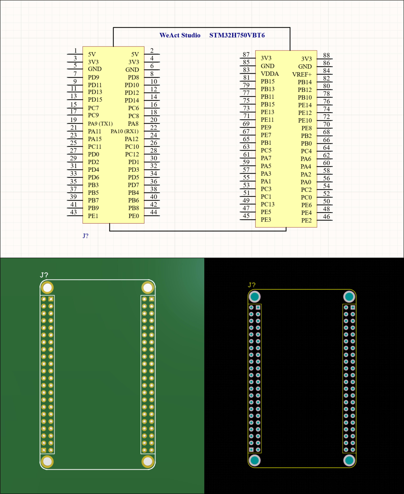

# STM32H750VBT6 Cortex M7 — Altium Integrated Library

Altium integrated library for the STM32H750VBT6 core board by [WeActStudio](https://github.com/WeActStudio/), designed to be used as a plug-in module. Place it as a footprint that plugs into female pin headers on your main PCB, rather than routing the STM32 directly.

> If the pin headers on the STM32 core board are soldered on top, you can flip the footprint in Altium Designer PCB to match the pin configuration.

This is a redesign of the Altium Integrated Library originally designed by [WeActStudio](https://github.com/WeActStudio/). This new design matches most commercially available boards in terms of footprint and pin configuration.

### Reference

[WeActStudio Design](https://github.com/WeActStudio/MiniSTM32H7xx)
